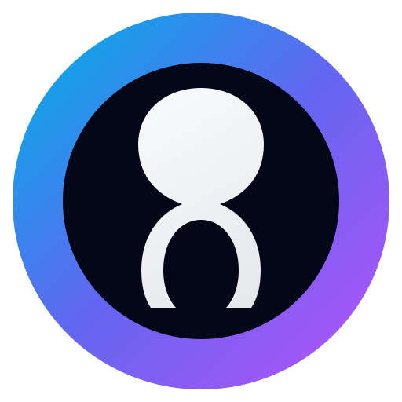
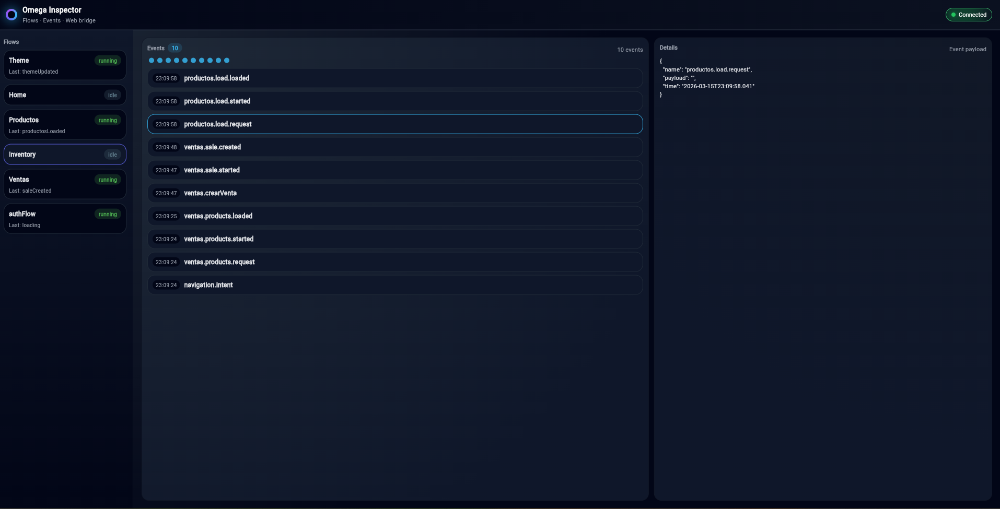
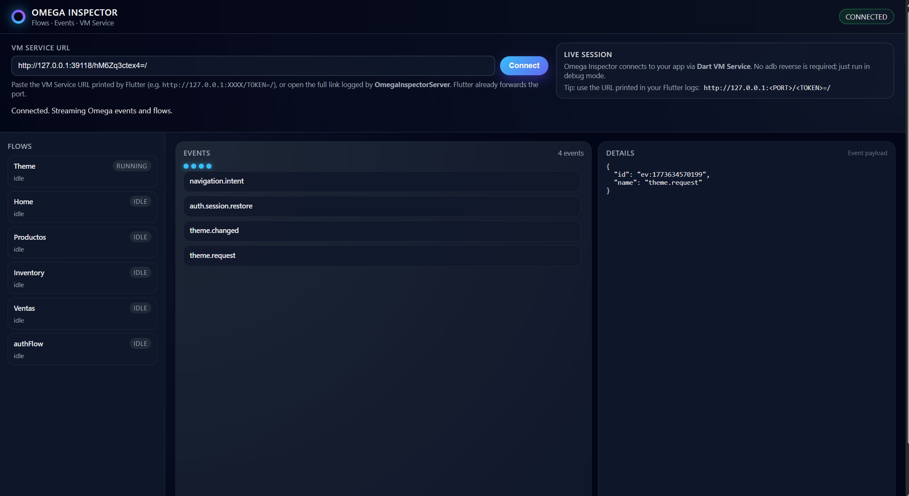

# Ω Omega Architecture

<p align="center">
  
</p>

[](https://pub.dev/packages/omega_architecture) [](https://pub.dev/documentation/omega_architecture/latest)

A reactive, agent-based architecture framework for Flutter applications.

**What Omega does:** Business logic lives in **agents** and **flows** that communicate through a central **event channel**. The UI only emits **intents** (e.g. "login", "navigate to home") and reacts to **events** and **expressions**; it does not call domain methods or hold navigation state. A **FlowManager** routes intents to the active flow(s); a **navigator** turns navigation intents into screens. So you get a clear separation: UI → intents/events → flows and agents → expressions/navigation → UI. For a **guided tour with examples** of each component, see **[doc/GUIA.md](doc/GUIA.md)**.

## Features

- **Reactive Agents** — Autonomous entities that react to system events and direct messages.
- **Stateful Agents (optional)** — [OmegaStatefulAgent<TState>] lets an agent expose a typed reactive `viewState` stream for UI/widgets without changing the core event/intent model.
- **Behavior Engine** — Decoupled logic using rules and conditions to determine agent reactions.
- **Event-Driven** — Global communication through `OmegaChannel`.
- **Flow Management** — Orchestrate complex state transitions and business logic flows; run one or multiple flows at once.
- **Workflow Flows (optional)** — [OmegaWorkflowFlow] adds step-based orchestration (`defineStep`, `startAt`, `next`, `failStep`) for complex multi-step processes such as checkout/onboarding while keeping [OmegaFlow] as the default.
- **Semantic Intents** — High-level abstraction for user or system requests. Optional **typed names** via [OmegaEventName]/[OmegaIntentName] and [OmegaEvent.fromName]/[OmegaIntent.fromName] to avoid magic strings and ease refactors. **Typed events (recommended):** define a class implementing [OmegaTypedEvent] (e.g. `LoginRequestedEvent(email, password)`) and emit with `channel.emitTyped(LoginRequestedEvent(...))`; listeners use `event.payloadAs<LoginRequestedEvent>()` for full type safety. **Typed payload when reading:** use the `payloadAs<T>()` extension on [OmegaEvent], [OmegaIntent], and [OmegaFlowExpression] to get a safely cast payload. See the [example](example/lib/omega/app_semantics.dart) and [GUIA § Eventos tipados](doc/GUIA.md) for full usage.
- **Persistence & restore** — Serialize [OmegaAppSnapshot] to JSON and restore on launch ([toJson]/[fromJson], [OmegaFlowManager.restoreFromSnapshot], optional [OmegaSnapshotStorage]).
- **Typed routes** — Use `OmegaRoute.typed<T>` so the route builder receives the intent payload as `T?`; or `routeArguments<T>(context)` when you don't use typed. See the [example](example/lib/omega/omega_setup.dart) (home route with `LoginSuccessPayload`).
- **Declarative contracts** — Optional [OmegaFlowContract] and [OmegaAgentContract] declare which events a flow listens to, which intents it accepts, and which expression types it emits (and for agents: events and intents). In **debug** mode Omega warns in the console when something is received or emitted that is not in the contract. **Example:** The [example](example/) app implements contracts in [AuthFlow](example/lib/auth/auth_flow.dart) and [AuthAgent](example/lib/auth/auth_agent.dart); run `cd example && flutter run` to see them in action. See [doc/CONTRACTS.md](doc/CONTRACTS.md).
- **Time-travel** — [OmegaTimeTravelRecorder] records channel events and an initial snapshot; [OmegaRecordedSession] holds them. Replay a session (or replay up to an event index) to restore state and re-emit events for debugging or demos. See [doc/TIME_TRAVEL.md](doc/TIME_TRAVEL.md).
- **CLI** — Scaffold setup and generate ecosystems (agent, flow, behavior, page) from the command line.

**Documentation:**  
- **[doc/GUIA.md](doc/GUIA.md)** — What each Omega component does, with **code examples** (channel, event, intent, agent, flow, manager, scope, navigator, routes, persistence, inspector). Start here to see how everything fits together.  
- **Documentation** — [API reference](https://pub.dev/documentation/omega_architecture/latest) (pub.dev). Full web doc (architecture, comparison, CLI, inspector): `yefersonsegura.com/proyects/omega/`. Local copy: [presentation/index.html](presentation/index.html). Run `dart run omega_architecture:omega doc` to open the doc in the browser.  
- **[doc/ARQUITECTURA.md](doc/ARQUITECTURA.md)** — Technical reference for each component.  
- **[doc/COMPARATIVA.md](doc/COMPARATIVA.md)** — When to choose Omega; full comparison table.  
- **[doc/TESTING.md](doc/TESTING.md)** — Testing agents and flows without Flutter.  
- **[doc/CONTRACTS.md](doc/CONTRACTS.md)** — Declarative contracts for flows and agents (events, intents, expression types); debug-time validation. The [example](example/) app is the reference implementation (AuthFlow, AuthAgent).
- **[doc/TIME_TRAVEL.md](doc/TIME_TRAVEL.md)** — Record and replay sessions; time-travel to a previous event index for debugging or demos.
- **[doc/ROADMAP.md](doc/ROADMAP.md)** — Long-term vision.

## Core Concepts

| Concept | Description |
|--------|-------------|
| **OmegaAgent** | Building block of the architecture. Has an ID, a channel, and a behavior engine. |
| **OmegaStatefulAgent** | Optional typed reactive agent state (`viewState` + `stateStream`) for UI updates. |
| **OmegaAgentBehaviorEngine** | Evaluates events/intents and returns reactions (actions to run). |
| **OmegaChannel** | Event bus. Agents and flows subscribe to `events` and use `emit()` to publish. |
| **OmegaFlow** | Business flow with states (idle, running, paused, etc.). Orchestrates UI and agents. |
| **OmegaWorkflowFlow** | Optional step-based process flow for advanced workflow engines. |
| **OmegaFlowManager** | Registers flows, routes intents to running flows, and activates/pauses them. |

## Getting Started

Add the dependency to your `pubspec.yaml`:

```yaml
dependencies:
  omega_architecture: ^0.0.16
```

## Omega CLI

The CLI helps you bootstrap Omega in your app and generate new ecosystems.

### How to run

From a project that depends on `omega_architecture`:

```bash
dart run omega_architecture:omega <command> [options] [arguments]
```

Or by path (from the `omega_architecture` repo):

```bash
dart run bin/omega.dart <command> [options] [arguments]
```

**Important:** The CLI runs in **your app’s** project (the host app that depends on `omega_architecture`). It uses the current directory to find your project root. **`omega init`** creates `lib/omega/omega_setup.dart` in your app. **`omega g ecosystem`** creates the ecosystem files in the **directory where you open the terminal** (current working directory), then finds `omega_setup.dart` in your project and registers the new agent and flow there. You own the setup and add your own routes.

### Commands (list)

Each command is listed below with **why** (purpose), **instruction**, **concept**, and **example** (success or failure where applicable). Global options: `-h`, `--help` · `-v`, `--version`.

---

#### doc

**Why:** Open the official docs from the terminal without searching the web or bookmarking the URL.

**Instruction:** `dart run omega_architecture:omega doc`

**Concept:** Opens the official Omega web documentation in the browser. Does not create or modify files.

**Example (success):** `Opening documentation: http://yefersonsegura.com/proyects/omega/`

---

#### init

**Why:** Your app needs one central place to register routes, agents and flows; `init` creates that file so you don’t have to write the boilerplate by hand.

**Instruction (both forms):**

- `dart run omega_architecture:omega init` — creates `lib/omega/omega_setup.dart` only if it does not exist. If the file already exists, the CLI reports an error (so you do not overwrite by mistake).
- `dart run omega_architecture:omega init --force` — overwrites the existing file. Use when you want to reset or regenerate the setup from scratch.

**Concept:** Creates `lib/omega/omega_setup.dart` in your app with an empty `OmegaConfig` (agents, flows, routes). Run from app root. By default the command is safe (no overwrite); use `--force` only when you intend to replace the current file.

**Example (success):**
```
Omega setup created.
  Project root: C:\...\my_app
  File: C:\...\my_app\lib\omega\omega_setup.dart
```

**Example (failure):** `Error: omega_setup.dart already exists. Use --force to overwrite.`

---

#### g ecosystem

**Why:** A full feature (e.g. Auth, Orders) usually needs an agent, a flow, a behavior and a page; this command creates all four and wires them in `omega_setup.dart` so you can focus on logic instead of boilerplate.

**Instruction:** `dart run omega_architecture:omega g ecosystem <Name>`

**Concept:** Generates agent, flow, behavior and page **in the current directory**, then registers agent and flow in `omega_setup.dart`. Run from the folder where you want the files. Requires `omega init` first.

**Example (success):**
```
Creating in current directory: C:\...\my_app\lib
Ecosystem Auth created.
  Path: C:\...\my_app\lib\auth
Registered Auth (agent, flow) in omega_setup.dart
```

**Example (failure):** `Error: omega_setup.dart not found. Run from app root: omega init`

---

#### g agent

**Why:** Sometimes you need only a new agent (and its behavior) for an existing flow or a feature that doesn’t need a full ecosystem; this avoids generating an extra flow and page.

**Instruction:** `dart run omega_architecture:omega g agent <Name>`

**Concept:** Generates only agent + behavior in the current directory. Updates only the agent import and registration in `omega_setup.dart` (does not touch the flow).

**Example (success):** `Agent Orders created. Path: C:\...\my_app\lib\orders`

---

#### g flow

**Why:** When you need only a new flow (orchestrator) without a new agent or page, this creates just the flow and registers it in `omega_setup.dart` without touching the rest.

**Instruction:** `dart run omega_architecture:omega g flow <Name>`

**Concept:** Generates only flow in the current directory. Updates only the flow import and registration in `omega_setup.dart` (does not touch the agent).

**Example (success):** `Flow Profile created. Path: C:\...\my_app\lib\profile`

---

#### validate

**Why:** Catches setup mistakes (missing config, duplicate agent/flow ids) before you run the app, so you can fix them quickly and avoid runtime errors.

**Instruction:** `dart run omega_architecture:omega validate [path]`

**Concept:** Checks `omega_setup.dart`: `createOmegaConfig`, `OmegaConfig`, `agents:`, and no duplicate agent/flow ids. Starts from bash directory (or optional path).

**Example (success):**
```
Valid.
  File: C:\...\my_app\lib\omega\omega_setup.dart
  Agents: 2, Flows: 3
```

**Example (failure):** `Error: Duplicate flow registration: Auth. Remove duplicate XFlow(channel) from omega_setup.dart.`

---

#### trace

**Why:** Recorded sessions (events + snapshot) can be saved as JSON; `trace view` and `trace validate` let you inspect or validate those files from the CLI (debugging, CI, or sharing a bug report) without running the app.

**Instruction:** `dart run omega_architecture:omega trace view <file.json>` · `dart run omega_architecture:omega trace validate <file.json>`

**Concept:** A **trace** is a JSON file with a recorded session (channel events and optional initial snapshot). It is built by **OmegaTimeTravelRecorder** in your app when you call `stopRecording()`; the developer chooses where to save the JSON (e.g. path_provider on mobile, download on web). `trace view` shows a summary (events count, snapshot). `trace validate` checks the structure; exit 0 if valid, 1 otherwise. Used for debugging, reproducing bugs, or sharing a case.

**Export example:** After `stopRecording()`, use `jsonEncode(session.toJson())` to get a string, then write it to a file (mobile: `path_provider` + `File.writeAsString`; web: blob + `<a download>`). See [doc/TIME_TRAVEL.md](doc/TIME_TRAVEL.md) § “Export session to JSON (trace file)” for full code.

**Example view (success):**
```
Trace: C:\...\trace.json
  Events: 42
  Initial snapshot: yes
```

**Example validate (success):** `Valid trace file. Path: C:\...\trace.json`

**Example (failure):** `Error: Invalid trace structure (expected 'events' list and optional 'initialSnapshot').`

---

#### doctor [path]

**Why:** One command to see if your Omega setup is valid, how many agents/flows you have, and optional hints (e.g. flows/agents without a contract), so you can fix issues before they cause problems at runtime.

**Instruction (both forms):**

- `dart run omega_architecture:omega doctor` — uses the current directory (bash CWD) to find the app root.
- `dart run omega_architecture:omega doctor <path>` — starts the search from the given path (e.g. `omega doctor example` when you are at the package root and want to check the `example/` app).

**Concept:** Project health: validates `omega_setup.dart`, counts agents and flows, optionally lists flows/agents without a contract (recommendation). By default it starts from the current directory; in a real project there is no `example/` folder. If you are in `lib/`, it looks for the `omega/` folder there. The optional `<path>` tells the CLI where to start looking (useful in repos that have an `example/` or multiple apps).

**Example (success):**
```
Directorio (bash): C:\...\my_app\lib
Omega Doctor
  Setup: C:\...\my_app\lib\omega\omega_setup.dart
  Agents: 2, Flows: 3

Health check passed.
```

---

#### create app <Name>

**Why:** Bootstrap a professional Flutter project with Omega in seconds, including a clean startup sequence and optionally AI-generated business logic tailored to your idea.

**Instruction:** `omega create app my_new_app [--kickstart "app description"] [--provider-api]`

**Concept:** Orchestrates `flutter create`, adds the `omega_architecture` dependency, runs `omega init`, and replaces the default `main.dart` with a clean Omega-ready entry point (`OmegaRuntime.bootstrap` + `OmegaScope`). If `--kickstart` is provided, the CLI uses AI to analyze your description and generate all necessary ecosystem modules (agents, flows, behavior, UI) with custom logic. This command must be run **outside** existing Flutter projects (it is a project creator).

**Example:**
```bash
# Basic setup
omega create app my_store

# Advanced AI kickstart (requires OMEGA_AI_API_KEY)
omega create app my_store --kickstart "an e-commerce with cart and stripe" --provider-api
```

---

**Example (errors):**
```
Error: Duplicate flow registration: Auth.
  Remove duplicate XFlow(channel) from omega_setup.dart.
Fix the issues above and run omega doctor again.
```

**Example (optional warnings):**
```
Optional (contracts):
  Flow without contract: ...\lib\orders\orders_flow.dart
  Agent without contract: ...\lib\provider\provider_agent.dart
  Tip: add a contract getter for clearer semantics and debug warnings.
Health check passed.
```

---

#### ai

**Why:** Analyze recorded traces faster with an AI-assisted diagnostic flow, while keeping a zero-cost offline mode as default/fallback.

**Instruction (main forms):**

- `dart run omega_architecture:omega ai doctor` — checks AI setup (`OMEGA_AI_ENABLED`, provider, model, base URL, API key).
- `dart run omega_architecture:omega ai env` — prints supported environment variables and examples.
- `dart run omega_architecture:omega ai explain <file.json>` — heuristic diagnosis from trace; by default writes a styled temp report and opens it.
- `dart run omega_architecture:omega ai explain <file.json> --json` — same diagnosis in machine-readable JSON.
- `dart run omega_architecture:omega ai explain <file.json> --provider-api` — tries provider API (currently OpenAI) and falls back to offline if config/network fails.
- `dart run omega_architecture:omega ai explain <file.json> --stdout` — print output directly in console (skip temp file).
- `dart run omega_architecture:omega ai coach start "<feature>"` — guided implementation plan (steps + required artifacts + validation checks); temp file by default.
- `dart run omega_architecture:omega ai coach audit "<feature>"` — audits current project for feature gaps (files, setup wiring, contracts, tests) and returns score/findings/gaps.
- `dart run omega_architecture:omega ai coach module "<Name>"` — generates a complete ecosystem with AI guidance. Use `--template advanced` for a sophisticated boilerplate with `OmegaWorkflowFlow`, `OmegaStatefulAgent`, and tests.

**Concept:** `ai explain` reads the same trace format used by `omega trace` (`events` list + optional `initialSnapshot`). In offline mode it reports top events, namespaces and heuristic checks (errors/failures/repetition). With `--provider-api`, it uses environment configuration and returns provider output when available; fallback is automatic to keep the command resilient. While waiting for provider responses, the CLI shows a progress status in terminal.

`ai coach start` helps you design features in Omega with architecture-first guidance. `ai coach audit` evaluates a real project state for a feature and highlights concrete gaps to close. `ai coach module` goes beyond simple scaffolding by using templates optimized for the latest Omega patterns.

**Future capabilities (WIP):**
- `ai coach fix-gaps` — Automatically create missing files and wiring detected by audit.
- `ai coach generate-tests` — Generate real test cases by analyzing flow and agent logic.
- `ai suggest-contracts` — Analyze logic and propose declarative contract definitions.
- `ai compare-traces` — Explain behavioral differences between two recorded sessions.
- `ai review-architecture` — Senior-level architectural report (couplings, naming, complexity).

**Language behavior:** provider and offline outputs are localized by system locale (`Platform.localeName`) and can be overridden with `OMEGA_AI_LANG` / `OMEGA_AI_LANGUAGE`.

**Environment variables (AI):**

- `OMEGA_AI_ENABLED` (`true|false`, default `false`)
- `OMEGA_AI_PROVIDER` (`openai | anthropic | gemini | ollama | none`)
- `OMEGA_AI_API_KEY` (optional for `ollama`)
- `OMEGA_AI_MODEL`
- `OMEGA_AI_BASE_URL` (optional custom endpoint)
- `OMEGA_AI_LANG` / `OMEGA_AI_LANGUAGE` (optional language override)

**Example (provider):**
```
dart run omega_architecture:omega ai explain trace.json --provider-api
Omega AI Explain (provider-api)
  Trace: C:\...\trace.json
  Events: 42
  ...
```

**Example (offline JSON):**
```
dart run omega_architecture:omega ai explain trace.json --json
{"trace":"C:\\...\\trace.json","events":42,"mode":"offline",...}
```

**Example (coach audit):**
```
dart run omega_architecture:omega ai coach audit "auth"
# writes .dart_tool/omega_ai_temp/omega_ai_coach_audit_<timestamp>.md
```

---

### How `g ecosystem` uses omega_setup

1. The CLI resolves your **project root** (directory that contains `pubspec.yaml`).
2. It looks for **`lib/omega/omega_setup.dart`**. If it doesn’t exist, it prints *"Run 'omega init' first"*.
3. It creates the ecosystem files in the **current directory**.
4. It **updates** `omega_setup.dart**: adds imports and registers the agent and flow. **`g agent`** and **`g flow`** update only that artifact’s import and registration. Aliases: `generate` and `create` are equivalent to `g`.

Generated by `omega g ecosystem Auth` (in the directory where you run the command):

- `auth/auth_agent.dart`, `auth/auth_flow.dart`, `auth/auth_behavior.dart`
- `auth/ui/auth_page.dart`
- **Updates to `lib/omega/omega_setup.dart`**: the CLI finds this file in your app, refreshes the imports for this ecosystem (correct path), and registers the new **agent** and **flow** in `OmegaConfig` (adds `flows:` if it was missing).

## Usage

### Agent and behavior

```dart
class MyBehavior extends OmegaAgentBehaviorEngine {
  @override
  OmegaAgentReaction? evaluate(OmegaAgentBehaviorContext ctx) {
    if (ctx.event?.name == "greet") {
      return const OmegaAgentReaction("sayHello", payload: "Welcome!");
    }
    return null;
  }
}

class MyAgent extends OmegaAgent {
  MyAgent(OmegaChannel channel)
      : super(id: "my_agent", channel: channel, behavior: MyBehavior());

  @override
  void onMessage(OmegaAgentMessage msg) {}

  @override
  void onAction(String action, dynamic payload) {
    if (action == "sayHello") print(payload);
  }
}

void main() {
  final channel = OmegaChannel();
  final agent = MyAgent(channel);
  channel.emit(const OmegaEvent(id: "1", name: "greet"));
}
```

### Flutter: OmegaScope and OmegaBuilder

Wrap your app with `OmegaScope` to provide `OmegaChannel` and `OmegaFlowManager`:

```dart
OmegaScope(
  channel: myChannel,
  flowManager: myFlowManager,
  child: MyApp(),
)
```

Use `OmegaBuilder` to rebuild UI when specific events occur:

```dart
OmegaBuilder(
  eventName: 'user.updated',
  builder: (context, event) {
    return Text('User: ${event?.payload['name']}');
  },
)
```

### Inspector (debug only)

In debug you can inspect the channel (last N events) and flow snapshots in three ways:

**1. Overlay in the app**

```dart
if (kDebugMode)
  Stack(
    children: [
      MyContent(),
      Positioned(right: 0, top: 0, child: OmegaInspector(eventLimit: 20)),
    ],
  )
```

**2. Launcher button (dialog on desktop/mobile, new window on web)**

Add the launcher in the AppBar (or anywhere); in debug it shows a button that opens the Inspector in a dialog (Android/iOS/desktop) or in a new browser tab (web). On web, the app must show `OmegaInspectorReceiver` when the URL has `?omega_inspector=1` (e.g. in `main.dart`: if the query param is set, run only `OmegaInspectorReceiver` as the app). The web receiver uses the same dark dashboard layout as the online inspector (flows sidebar, events list, JSON details panel).

```dart
if (kDebugMode)
  AppBar(
    title: Text('My App'),
    actions: [OmegaInspectorLauncher()],
  )
```

**3. Online Inspector (VM Service + web)**

On Android/iOS/desktop you can debug the app from the PC using the hosted Inspector page. `OmegaInspectorServer.start` registers a VM Service extension and prints a URL like:

```text
http://yefersonsegura.com/projects/omega/inspector.html#<encoded-VM-URL>
```

Open that URL in a desktop browser and the page will auto-connect to your running app; alternatively, copy the raw VM Service URL that Flutter prints (e.g. `http://127.0.0.1:PORT/TOKEN=/`) and paste it in the Inspector input. You can also run:

```bash
dart run omega_architecture:omega inspector
```

which opens the same hosted Inspector so you only have to paste the hash or VM Service URL from the app logs.

All Inspector widgets and the server are no-op in release (`kDebugMode` guards). See the [example](example/) app for full usage; [doc/INSPECTOR.md](doc/INSPECTOR.md) has a copy-paste guide and troubleshooting.

#### Inspector UIs (local vs online)

- **Local Inspector (web / overlay)**  
  When you use `OmegaInspector` inside the app or open the web receiver (`OmegaInspectorReceiver` via `OmegaInspectorLauncher`), you get a dark dashboard embedded in Flutter: sidebar with flows, events list with a small timeline of dots, and a JSON details panel for the selected event/flow.

  

- **Online Inspector (VM Service + web)**  
  When you open the hosted page `http://yefersonsegura.com/projects/omega/inspector.html#<encoded-VM-URL>`, you see the same layout but running in the browser: connection bar at the top (VM Service URL + auto-connect), flows on the left, events + details on the right. It talks to your running app through the Dart VM Service and works for Android, iOS and desktop.

  

### Activating flows

- **Several flows at once:** use `flowManager.activate("flowId")` for each. All stay in `running` and receive intents via `handleIntent`.
- **Single “main” flow:** use `flowManager.switchTo("flowId")` to activate one and pause the others.

### Persistence (restore on launch)

To save app state and restore it when the user reopens the app:

1. **Serialize:** `final json = flowManager.getAppSnapshot().toJson()` then save (e.g. `jsonEncode(json)` to a file or `SharedPreferences`). Flow `memory` values must be JSON-serializable.
2. **Restore:** On startup, load the saved map, then `final snapshot = OmegaAppSnapshot.fromJson(jsonDecode(loaded)); flowManager.restoreFromSnapshot(snapshot);`. This restores each flow's memory and activates the previous active flow.
3. **Optional:** Implement [OmegaSnapshotStorage] (`save` / `load`) with your preferred backend (file, prefs, API) and call it from app lifecycle. See [doc/ARQUITECTURA.md](doc/ARQUITECTURA.md) for details.

### Declarative contracts (optional)

You can declare what each flow and agent is allowed to receive and emit. Override `contract` in your flow or agent and return an [OmegaFlowContract] or [OmegaAgentContract]. In **debug** mode, Omega prints a warning when a flow receives an event or intent not in its contract, or emits an expression type not declared (and similarly for agents). Empty sets mean no constraint; if you don't set a contract, behavior is unchanged.

```dart
// In your flow
@override
OmegaFlowContract? get contract => OmegaFlowContract.fromTyped(
  listenedEvents: [AppEvent.authLoginSuccess, AppEvent.authLoginError],
  acceptedIntents: [AppIntent.authLogin, AppIntent.authLogout],
  emittedExpressionTypes: {'loading', 'success', 'error'},
);

// In your agent
@override
OmegaAgentContract? get contract => OmegaAgentContract.fromTyped(
  listenedEvents: [AppEvent.authLoginRequest],
  acceptedIntents: [AppIntent.authLogin],
);
```

**Reference:** The [example](example/) app implements contracts in [AuthFlow](example/lib/auth/auth_flow.dart) and [AuthAgent](example/lib/auth/auth_agent.dart)—run `cd example && flutter run` to try it. See **[doc/CONTRACTS.md](doc/CONTRACTS.md)** for full details.

### Lifecycle and dispose

- **OmegaChannel** — Whoever creates it should call `channel.dispose()` when the app is shutting down.
- **OmegaFlowManager** — Call `flowManager.dispose()` to cancel the subscription used by `wireNavigator`.
- **OmegaAgent** — Call `agent.dispose()` so the agent unsubscribes from the channel.
- **OmegaScope** does not dispose anything; the widget that creates `channel` and `flowManager` should call their `dispose()` in its `State.dispose`.

## Example: Authentication flow

A full example lives in the **`example/`** folder. Run it with `cd example && flutter run`. It shows:

1. **UI** — Login screen that emits intents with typed payload (`LoginCredentials`).
2. **Flow** — Orchestrates login, reads payload with `payloadAs<LoginCredentials>()`, navigates to home with `OmegaIntent.fromName(AppIntent.navigateHome, payload: userData)`.
3. **Agent** — Performs login logic, emits `LoginSuccessPayload` or `OmegaFailure`.
4. **Behavior** — Rules that react to auth events/intents.
5. **Typed route** — Home registered as `OmegaRoute.typed<LoginSuccessPayload>` so the screen receives the payload without casting.

Relevant files:

- [Omega setup (config, routes)](example/lib/omega/omega_setup.dart)
- [Main entry](example/lib/main.dart)
- [Auth flow](example/lib/auth/auth_flow.dart)
- [Auth agent](example/lib/auth/auth_agent.dart)
- [Login page](example/lib/auth/ui/auth_page.dart)
- [Home (typed payload)](example/lib/home/home.dart)
- [Models (LoginCredentials, LoginSuccessPayload)](example/lib/auth/models.dart)
- [App semantics (AppEvent, AppIntent)](example/lib/omega/app_semantics.dart)

## Project structure

```
lib/
├── omega/
│   ├── core/          # Channel, events, intents, types
│   ├── agents/        # OmegaAgent, behavior engine, protocol
│   ├── flows/         # OmegaFlow, OmegaFlowManager, expressions
│   ├── ui/            # OmegaScope, OmegaBuilder, navigation
│   └── bootstrap/     # Config, runtime
├── examples/          # Full examples and feature demos
└── omega_architecture.dart  # Barrel exports
```

## License

See [LICENSE](LICENSE).
