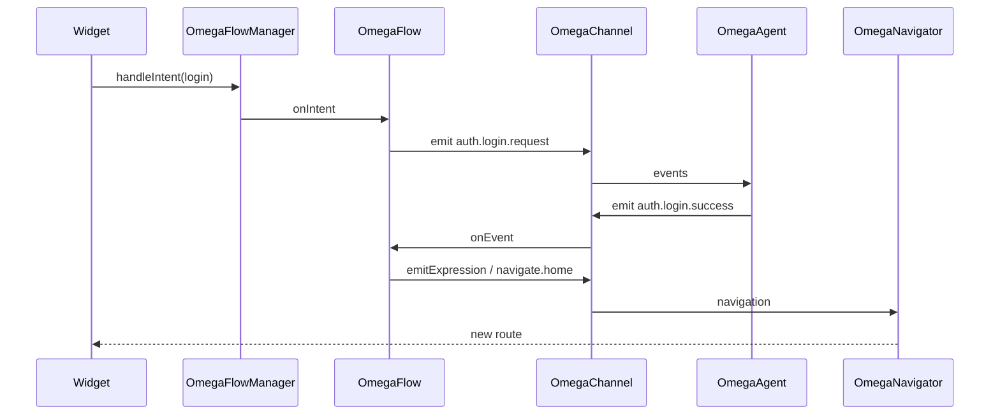

# Data flow

End-to-end path through the system (the **spine** of every Omega feature):

1. **UI** → emits an **[OmegaIntent](https://pub.dev/documentation/omega_architecture/latest/omega_architecture/OmegaIntent-class.html)** (e.g. login) via **[OmegaFlowManager.handleIntent](https://pub.dev/documentation/omega_architecture/latest/omega_architecture/OmegaFlowManager/handleIntent.html)** (or occasionally the channel, for global intents).  
2. **Flow** (when **running**) receives it in **`onIntent`**; may emit **[OmegaEvent](https://pub.dev/documentation/omega_architecture/latest/omega_architecture/OmegaEvent-class.html)s** on the channel (e.g. `auth.login.request`).  
3. **Agent** listens; **behavior** picks a reaction (e.g. `doLogin`); agent emits success / failure **events**.  
4. **Flow** handles events in **`onEvent`**; emits **expressions** for the UI and/or **navigation** events / intents.  
5. **UI** rebuilds from **expressions** or **`OmegaBuilder`**; **[OmegaNavigator](https://pub.dev/documentation/omega_architecture/latest/omega_architecture/OmegaNavigator-class.html)** resolves navigation to **routes**.

---

## Where to read code

Follow **`example/lib/auth/`** on GitHub after reading **[Channel & events](./channel-events)** and **[Intents, flows & manager](./intents-flows-manager)**.

---

## Next

- [Core concepts](./concepts)  
- [Total architecture](./total-architecture)  
