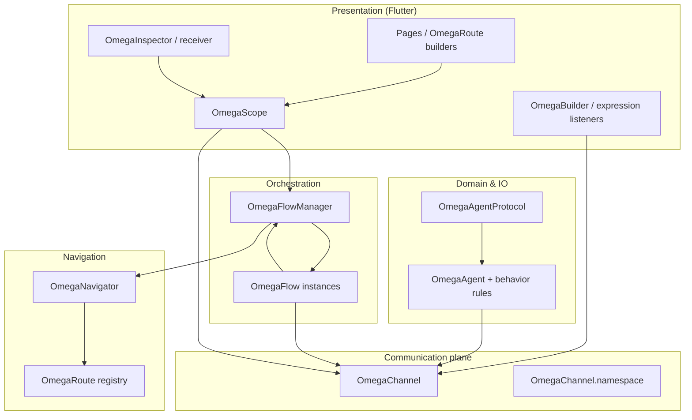
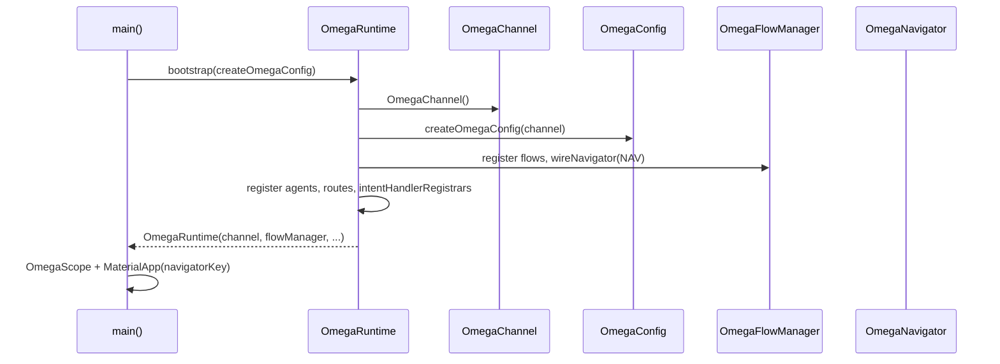
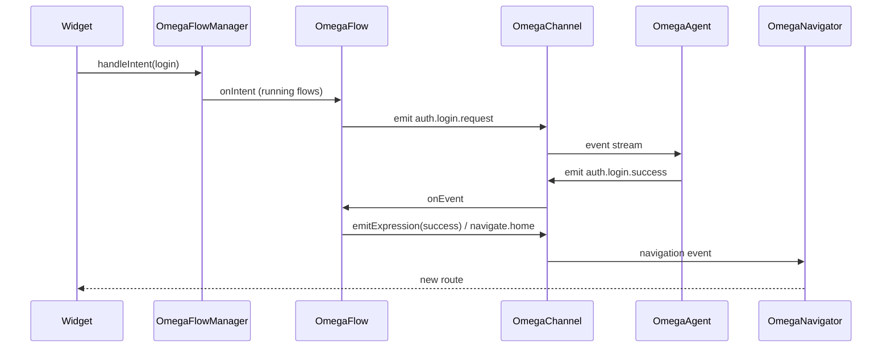

# Total architecture

This page is the **single map** of the whole **omega_architecture** stack: how runtime, channel, flows, agents, navigation, Flutter widgets, and tooling fit together. Use it before diving into the focused guides linked in each section.

For a narrative “why” and product fit, start with [Vision & why Omega](./vision-and-why). For step-by-step setup, see [Getting started](./getting-started) and [omega_setup.dart](./omega-setup).

---

## What Omega optimizes for

- **One communication plane** — [OmegaChannel](https://pub.dev/documentation/omega_architecture/latest/omega_architecture/OmegaChannel-class.html) broadcasts [OmegaEvent](https://pub.dev/documentation/omega_architecture/latest/omega_architecture/OmegaEvent-class.html)s; the UI and domain code do not call each other directly.
- **Intent-first UI** — Screens emit [OmegaIntent](https://pub.dev/documentation/omega_architecture/latest/omega_architecture/OmegaIntent-class.html)s; [OmegaFlowManager](https://pub.dev/documentation/omega_architecture/latest/omega_architecture/OmegaFlowManager-class.html) routes them to **running** [OmegaFlow](https://pub.dev/documentation/omega_architecture/latest/omega_architecture/OmegaFlow-class.html)s.
- **Agents for side effects** — [OmegaAgent](https://pub.dev/documentation/omega_architecture/latest/omega_architecture/OmegaAgent-class.html) + [OmegaAgentBehaviorEngine](https://pub.dev/documentation/omega_architecture/latest/omega_architecture/OmegaAgentBehaviorEngine-class.html) centralize IO, storage, and imperative work; widgets stay thin.
- **Observable orchestration** — Flows emit **expressions** (streams) for UI state and can trigger **navigation** through the same channel conventions the navigator listens for.

More narrative walkthroughs: [Getting started](./getting-started), [Channel & events](./channel-events), and the **[example app](https://github.com/yefersonSegura/omega_architecture/tree/main/example)** on GitHub.

---

## Layers at a glance

| Layer | Responsibility | Typical types |
|-------|----------------|---------------|
| **Communication plane** | Broadcast events; optional per-module namespaces | `OmegaChannel`, `OmegaEvent`, typed names via `OmegaEventName` / `OmegaIntentName` |
| **Orchestration** | Which flow is active; handle intents; translate channel traffic into expressions and navigation signals | `OmegaFlowManager`, `OmegaFlow`, `OmegaFlowContext`, `OmegaFlowExpression` |
| **Domain & IO** | Reactions to events (HTTP, DB, device); optional direct agent messaging | `OmegaAgent`, `OmegaAgentBehaviorEngine`, `OmegaAgentProtocol` |
| **Navigation** | Map `navigate.*` / `navigation.intent` to Flutter routes | `OmegaNavigator`, `OmegaRoute` |
| **Presentation** | Inject dependencies; rebuild on events/expressions; debug surfaces | `OmegaScope`, builders, inspector |

---

## Bootstrap: from `main` to a live app

[OmegaRuntime.bootstrap](https://pub.dev/documentation/omega_architecture/latest/omega_architecture/OmegaRuntime/OmegaRuntime.bootstrap.html) is the **single factory** that wires everything:

1. Creates one [OmegaChannel](https://pub.dev/documentation/omega_architecture/latest/omega_architecture/OmegaChannel-class.html).
2. Calls your `OmegaConfig Function(OmegaChannel)` (usually `createOmegaConfig` in `omega_setup.dart`).
3. Builds [OmegaFlowManager](https://pub.dev/documentation/omega_architecture/latest/omega_architecture/OmegaFlowManager-class.html), [OmegaAgentProtocol](https://pub.dev/documentation/omega_architecture/latest/omega_architecture/OmegaAgentProtocol-class.html), and [OmegaNavigator](https://pub.dev/documentation/omega_architecture/latest/omega_architecture/OmegaNavigator-class.html).
4. Registers **agents**, **flows**, and **routes** from [OmegaConfig](https://pub.dev/documentation/omega_architecture/latest/omega_architecture/OmegaConfig-class.html).
5. Calls [wireNavigator](https://pub.dev/documentation/omega_architecture/latest/omega_architecture/OmegaFlowManager/wireNavigator.html) so navigation events on the channel reach the navigator.
6. Runs optional [intentHandlerRegistrars](https://pub.dev/documentation/omega_architecture/latest/omega_architecture/OmegaConfig/intentHandlerRegistrars.html) (e.g. `OmegaFlowManager.registerIntentHandler`, lightweight pipelines).

Cold start is explicit: [initialFlowId](https://pub.dev/documentation/omega_architecture/latest/omega_architecture/OmegaConfig/initialFlowId.html) selects which flow is **running**; [initialNavigationIntent](https://pub.dev/documentation/omega_architecture/latest/omega_architecture/OmegaConfig/initialNavigationIntent.html) (with [OmegaInitialRoute](https://pub.dev/documentation/omega_architecture/latest/omega_architecture/OmegaInitialRoute-class.html) / [OmegaScope.initialNavigationIntent](https://pub.dev/documentation/omega_architecture/latest/omega_architecture/OmegaScope/initialNavigationIntent.html)) aligns the **first** `Navigator` screen with `navigate.*` semantics. Details: [omega_setup.dart](./omega-setup), [Navigation & routes](./navigation-router).

---

## Channel, namespaces, events, and intents

- **Events** — “Something happened” (`OmegaEvent`: id, name, payload). Consumers use [payloadAs](https://pub.dev/documentation/omega_architecture/latest/omega_architecture/OmegaObject/payloadAs.html) for typed reads.
- **Intents** — “Something is requested” (`OmegaIntent`). The flow manager delivers intents to flows in `running` state; navigation uses the same intent model with names like `navigate.login` or `navigate.push.detail`.
- **Namespaces** — [OmegaChannel.namespace](https://pub.dev/documentation/omega_architecture/latest/omega_architecture/OmegaChannel/namespace.html) scopes traffic by module (auth, checkout, …) while sharing one physical channel.
- **Typed wire names** — Prefer enums implementing [OmegaEventName](https://pub.dev/documentation/omega_architecture/latest/omega_architecture/OmegaEventName-class.html) / [OmegaIntentName](https://pub.dev/documentation/omega_architecture/latest/omega_architecture/OmegaIntentName-class.html) with [OmegaEvent.fromName](https://pub.dev/documentation/omega_architecture/latest/omega_architecture/OmegaEvent/OmegaEvent.fromName.html) / [OmegaIntent.fromName](https://pub.dev/documentation/omega_architecture/latest/omega_architecture/OmegaIntent/OmegaIntent.fromName.html) instead of raw strings.

More detail: [Channel & events](./channel-events), [Data flow](./data-flow).

---

## Flows and flow manager

| Piece | Role |
|-------|------|
| [OmegaFlow](https://pub.dev/documentation/omega_architecture/latest/omega_architecture/OmegaFlow-class.html) | Business process: [onIntent](https://pub.dev/documentation/omega_architecture/latest/omega_architecture/OmegaFlow/onIntent.html), [onEvent](https://pub.dev/documentation/omega_architecture/latest/omega_architecture/OmegaFlow/onEvent.html), emits **expressions** for UI and events for agents / navigation |
| [OmegaFlowManager](https://pub.dev/documentation/omega_architecture/latest/omega_architecture/OmegaFlowManager-class.html) | Registers flows; [activate](https://pub.dev/documentation/omega_architecture/latest/omega_architecture/OmegaFlowManager/activate.html) / [switchTo](https://pub.dev/documentation/omega_architecture/latest/omega_architecture/OmegaFlowManager/switchTo.html); [handleIntent](https://pub.dev/documentation/omega_architecture/latest/omega_architecture/OmegaFlowManager/handleIntent.html) to running flows |
| [OmegaFlowState](https://pub.dev/documentation/omega_architecture/latest/omega_architecture/OmegaFlowState.html) | Only **running** flows receive intents and process events |
| [OmegaFlowExpression](https://pub.dev/documentation/omega_architecture/latest/omega_architecture/OmegaFlowExpression-class.html) | UI-facing stream of state (loading, success, error, …) |
| [OmegaFlowContext](https://pub.dev/documentation/omega_architecture/latest/omega_architecture/OmegaFlowContext-class.html) | Context passed into `onIntent` / `onEvent` |
| [OmegaWorkflowFlow](https://pub.dev/documentation/omega_architecture/latest/omega_architecture/OmegaWorkflowFlow-class.html) | Step-based flows built on the same channel model |

Optional [OmegaFlowContract](https://pub.dev/documentation/omega_architecture/latest/omega_architecture/OmegaFlowContract-class.html) documents listened events, handled intents, and emitted expression kinds; in **debug**, mismatches are reported. See **`example/lib/auth/`** (`AuthFlow` / `AuthAgent`) for `contract` usage.

**Snapshots** — [OmegaFlowSnapshot](https://pub.dev/documentation/omega_architecture/latest/omega_architecture/OmegaFlowSnapshot-class.html) / app-level snapshots support debugging, persistence, and time-travel tooling ([OmegaSnapshotStorage](https://pub.dev/documentation/omega_architecture/latest/omega_architecture/OmegaSnapshotStorage-class.html), [restoreFromSnapshot](https://pub.dev/documentation/omega_architecture/latest/omega_architecture/OmegaFlowManager/restoreFromSnapshot.html)).

Focused guides: [Intents, flows & manager](./intents-flows-manager), [Data flow](./data-flow).

---

## Agents and behaviors

| Piece | Role |
|-------|------|
| [OmegaAgent](https://pub.dev/documentation/omega_architecture/latest/omega_architecture/OmegaAgent-class.html) | Listens to the channel; delegates decisions to the behavior engine; runs [onAction](https://pub.dev/documentation/omega_architecture/latest/omega_architecture/OmegaAgent/onAction.html) for imperative work |
| [OmegaAgentBehaviorEngine](https://pub.dev/documentation/omega_architecture/latest/omega_architecture/OmegaAgentBehaviorEngine-class.html) | Evaluates [OmegaAgentBehaviorRule](https://pub.dev/documentation/omega_architecture/latest/omega_architecture/OmegaAgentBehaviorRule-class.html)s or custom logic → [OmegaAgentReaction](https://pub.dev/documentation/omega_architecture/latest/omega_architecture/OmegaAgentReaction-class.html) |
| [OmegaAgentProtocol](https://pub.dev/documentation/omega_architecture/latest/omega_architecture/OmegaAgentProtocol-class.html) | Registry + **direct** / broadcast messaging between agents ([OmegaAgentMessage](https://pub.dev/documentation/omega_architecture/latest/omega_architecture/OmegaAgentMessage-class.html), inbox) — not a replacement for the global channel |

Optional [OmegaAgentContract](https://pub.dev/documentation/omega_architecture/latest/omega_architecture/OmegaAgentContract-class.html) mirrors the flow contract idea for agents.

Focused guide: [Agents & behaviors](./agents-behaviors).

---

## Navigation

[OmegaFlowManager.wireNavigator](https://pub.dev/documentation/omega_architecture/latest/omega_architecture/OmegaFlowManager/wireNavigator.html) connects the channel to [OmegaNavigator](https://pub.dev/documentation/omega_architecture/latest/omega_architecture/OmegaNavigator-class.html):

- Payload [OmegaIntent](https://pub.dev/documentation/omega_architecture/latest/omega_architecture/OmegaIntent-class.html) on `navigation.intent`, or
- Event names `navigate.<id>` / `navigate.push.<id>` derived into intents.

[OmegaRoute](https://pub.dev/documentation/omega_architecture/latest/omega_architecture/OmegaRoute-class.html) registers builders; [OmegaRoute.typed](https://pub.dev/documentation/omega_architecture/latest/omega_architecture/OmegaRoute/OmegaRoute.typed.html) avoids manual `arguments` casts.

Focused guide: [Navigation & routes](./navigation-router).

---

## Flutter UI integration

| Widget / API | Use when |
|--------------|----------|
| [OmegaScope](https://pub.dev/documentation/omega_architecture/latest/omega_architecture/OmegaScope-class.html) | Root: exposes channel, flow manager, optional initial flow / navigation intent |
| [OmegaAgentScope](https://pub.dev/documentation/omega_architecture/latest/omega_architecture/OmegaAgentScope-class.html) / [OmegaScopedAgentBuilder](https://pub.dev/documentation/omega_architecture/latest/omega_architecture/OmegaScopedAgentBuilder-class.html) | Bind subtree to a specific agent and its view state |
| [OmegaFlowActivator](https://pub.dev/documentation/omega_architecture/latest/omega_architecture/OmegaFlowActivator-class.html) | Activate flows from UI where needed |
| [OmegaFlowExpressionBuilder](https://pub.dev/documentation/omega_architecture/latest/omega_architecture/OmegaFlowExpressionBuilder-class.html) | Rebuild from a flow’s expression stream |
| [OmegaBuilder](https://pub.dev/documentation/omega_architecture/latest/omega_architecture/OmegaBuilder-class.html) | Rebuild on a **named** channel event |
| [OmegaInitialRoute](https://pub.dev/documentation/omega_architecture/latest/omega_architecture/OmegaInitialRoute-class.html) / [OmegaInitialNavigationEmitter](https://pub.dev/documentation/omega_architecture/latest/omega_architecture/OmegaInitialNavigationEmitter-class.html) | Cold start navigation |
| [OmegaInspector](https://pub.dev/documentation/omega_architecture/latest/omega_architecture/OmegaInspector-class.html) / [OmegaInspectorReceiver](https://pub.dev/documentation/omega_architecture/latest/omega_architecture/OmegaInspectorReceiver-class.html) / launcher | Debug: events + flow snapshots (including multi-window web) |

---

## Lightweight intent handling (optional)

For small apps you can register [OmegaFlowManager.registerIntentHandler](https://pub.dev/documentation/omega_architecture/latest/omega_architecture/OmegaFlowManager/registerIntentHandler.html) or use [Omega.handle](https://pub.dev/documentation/omega_architecture/latest/omega_architecture/Omega-class.html) / [OmegaIntentReducer](https://pub.dev/documentation/omega_architecture/latest/omega_architecture/OmegaIntentReducer-class.html) / [OmegaIntentHandlerPipeline](https://pub.dev/documentation/omega_architecture/latest/omega_architecture/OmegaIntentHandlerPipeline-class.html) without a dedicated flow class — often wired through `OmegaConfig.intentHandlerRegistrars` after bootstrap.

---

## Cross-cutting concerns

| Topic | Where it lives |
|-------|----------------|
| **Failures** | [OmegaFailure](https://pub.dev/documentation/omega_architecture/latest/omega_architecture/OmegaFailure-class.html) for semantic errors on the channel or return paths |
| **Contracts (debug)** | [OmegaFlowContract](https://pub.dev/documentation/omega_architecture/latest/omega_architecture/OmegaFlowContract-class.html), [OmegaAgentContract](https://pub.dev/documentation/omega_architecture/latest/omega_architecture/OmegaAgentContract-class.html) — guide: **[Contracts](./contracts)** |
| **Time travel** | [OmegaTimeTravelRecorder](https://pub.dev/documentation/omega_architecture/latest/omega_architecture/OmegaTimeTravelRecorder-class.html), [OmegaRecordedSession](https://pub.dev/documentation/omega_architecture/latest/omega_architecture/OmegaRecordedSession-class.html) — **[Time travel](./time-travel)**, **`omega trace`** ([CLI](./cli)) |
| **Offline-first intents** | [OmegaOfflineQueue](https://pub.dev/documentation/omega_architecture/latest/omega_architecture/OmegaOfflineQueue-class.html) — **[Offline-first](./offline-first)** |
| **Package barrel** | [omega_architecture.dart](https://github.com/yefersonSegura/omega_architecture/blob/main/lib/omega_architecture.dart) — canonical exports |

---

## Repository and tooling (outside `lib/omega`)

| Area | Role |
|------|------|
| **`example/`** | Runnable reference: `omega_setup.dart`, auth flow/agent, routes |
| **`bin/omega.dart`** | **omega** CLI: `create app`, ecosystem generation, validate, traces, optional AI helpers |
| **`docs/`** | This VitePress site; `public/inspector.html` for VM Service inspector page |

Guides: [Repository layout](./repository), [Omega CLI](./cli), [Inspector & VM Service](./inspector), [Testing](./testing).

---

## End-to-end intent → screen (summary)

---

## Suggested reading order

1. [Vision & why Omega](./vision-and-why) → [Getting started](./getting-started)  
2. **This page** (total map) → [Core concepts](./concepts) → [Data flow](./data-flow)  
3. [omega_setup.dart](./omega-setup) → [Channel & events](./channel-events) → [Intents, flows & manager](./intents-flows-manager) → [Agents & behaviors](./agents-behaviors) → [Navigation & routes](./navigation-router)  
4. [API reference](./api-reference) on pub.dev for signatures  
5. [Example app](./example-app) while reading `example/lib/` on GitHub
